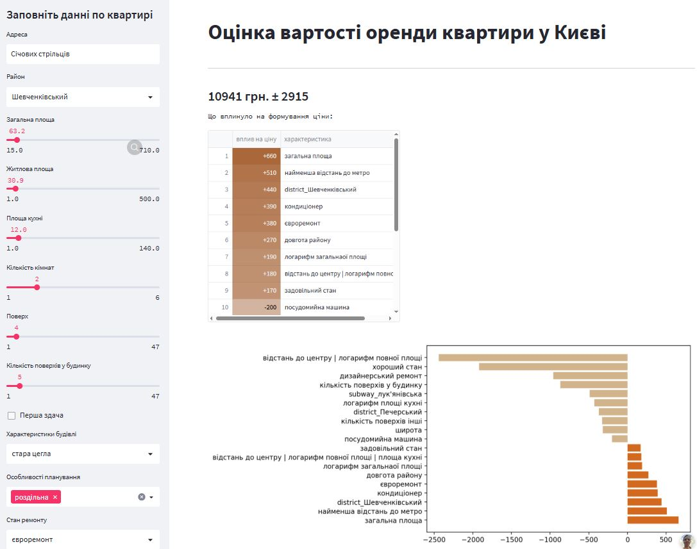

# 📦 Streamlit App for Predicting the Price of Renting an Apartment in Kyiv

## [Demo App](https://rent-price.streamlit.app/)

[](https://rent-price.streamlit.app/)

---

## Project Description

This project provides a machine learning-powered web application to predict rental prices for apartments in Kyiv. The app is built with **Streamlit** and powered by a **LightGBM regression model** enhanced with **conformal prediction intervals (MAPIE)**.


Users can input apartment details such as:
- Address, district
- Number of rooms and total area
- Floor and building type
- Amenities in apartment

and get an estimated rental price with confidence intervals.

## Demo

The project includes a Streamlit web app for interactive rental price prediction.

### Screenshot


### Features

- Predicts apartment rental prices based on:
  - Location (district, address)
  - Apartment size (full, living, kitchen area)
  - Number of rooms, floor, and building details
  - Amenities and repair state
- Provides prediction intervals for price estimates
- Explains model predictions with feature importance

### Workflow

1. **Data Collection & Cleaning**
    - Scraped rental listings from site
    - Cleaned and preprocessed data
2. **Feature Engineering**
    - Created additional features (e.g., geocoding, area ratios)
    - See [noteboks/real_estate_feature_eng.ipynb](noteboks/real_estate_feature_eng.ipynb)
3. **Model Training**
    - Trained LightGBM model with pipeline ([src/model.py](src/model.py))
    - Saved models to [data/](data/)
4. **Prediction & Explanation**
    - Streamlit app ([app.py](app.py)) loads models and provides predictions with explanations

### Technologies Used

- Python, Pandas, NumPy
- Scikit-learn, LightGBM, XGBoost, MAPIE
- Streamlit (web app)
- Geopy (geocoding)
- Matplotlib (visualization)

---

## Project Structure

```
.
├── app.py                          # Streamlit app entry point
├── src/
│   ├── inference                   # Inference and production logic
│   │   ├── model.py                # Model training and saving
│   │   ├── predict_price.py        # Prediction and explanation logic
│   │   └── preprocessing.py        # Feature preprocessing utilities
│   ├── models                      # Modeling utilities
│   │   ├── model_evaluation.py     # Cross-validation and metrics
│   │   └── pipeline_utils.py       # Pipeline builders
│   ├── utils                       # General utilities
│   │   └── eda_utils.py            # Functions for exploratory data analysis
├── data/
│   ├── external                    # External reference data
│   │   ├── district_location.csv   # District geodata
│   │   └── subway_location.csv     # Subway geodata
│   ├── real_estate_last.csv        # Latest cleaned dataset
│   ├── lgb_model.sav               # Trained LightGBM model
│   ├── mapie_reg_lgb.sav           # Model with uncertainty estimation
├── images/                         # App screenshots
│   └── demo_screenshot.jpg
├── styles/                         # Custom styles for matplotlib/seaborn
│   └── presentation.mplstyle
├── notebooks/                      # Jupyter notebooks for EDA, experiments and feature engineering
├── requirements.txt
└── README.md
```

---

## How to Run Locally

1. **Install dependencies**
    ```sh
    pip install -r requirements.txt
    ```

2. **Train or update the model (optional)**
    ```sh
    python src/model.py
    ```

3. **Start the Streamlit app**
    ```sh
    streamlit run app.py
    ```

---

## Usage

- Fill in apartment details in the sidebar.
- Click "Оцінити" to get a price estimate and prediction interval.
- View feature importance for the prediction.
